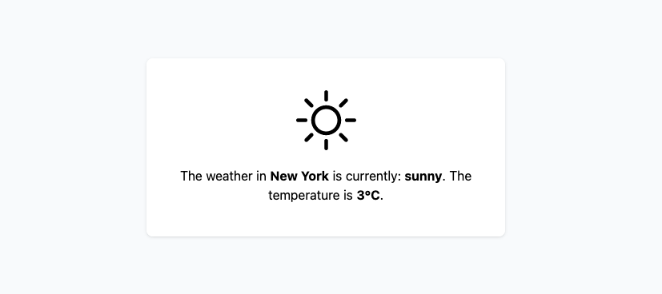
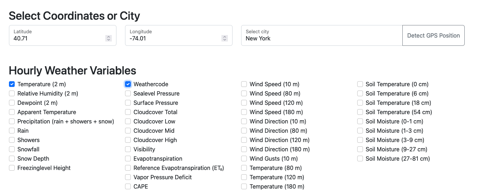
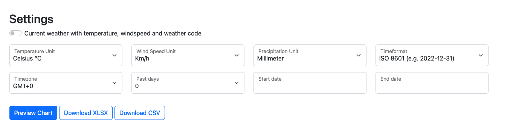
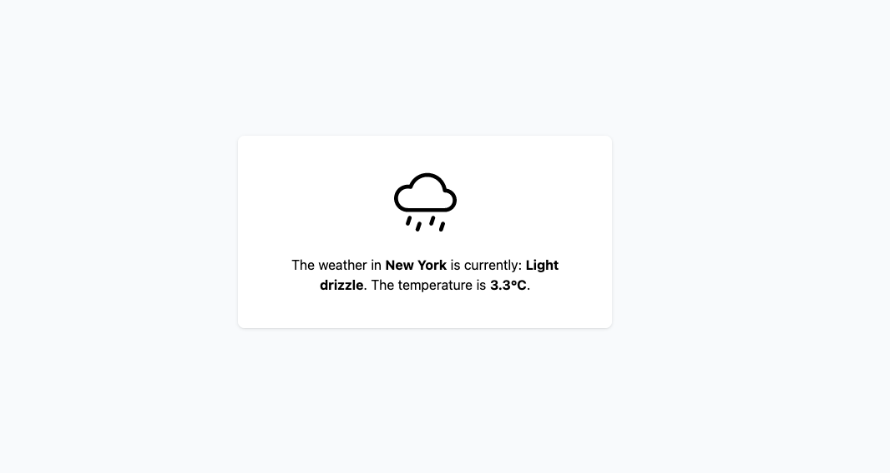

# Weather app

Create a simple weather app with Vue3, tailwind and host it on AWS S3 and CloudFront.

[[toc]]

## Prerequisites

In order to proceed with the tutorial you need:

* Node.JS
* Visual Studio Code
* AWS Account

## Install Amplify CLI

1. First, ensure that you have Node.js installed on your computer. If you don't have Node.js installed, you can download and install it from the official Node.js website: https://nodejs.org/.
2. Once Node.js is installed, open a command prompt or terminal window on your computer.
3. To install the AWS Amplify CLI, you can use the following command:
   ```sh
   $ npm install -g @aws-amplify/cli
   ```
   This command will install the latest version of the Amplify CLI globally on your computer.

4. After installation, you can verify that the Amplify CLI is installed correctly by running the following command:
   ```sh
   $ amplify --version
   ```
   This command should return the version number of the Amplify CLI that you just installed.

That's it! You've successfully installed the AWS Amplify CLI on your computer. Now you can use the Amplify CLI to create, configure, and deploy AWS Amplify applications from your command line.

## Configure Amplify

1. Once you have installed the Amplify CLI, open a command prompt or terminal window on your computer.
2. Run the following command to configure the Amplify CLI:
   ```sh
   $ amplify configure
   ```
3. You will be prompted to log in to your AWS account. Enter your AWS access key ID and secret access key when prompted. If you don't have an AWS account or access keys, you can create them in the AWS Management Console.
4. You will also be prompted to choose a default region for your Amplify projects. Select the region that is closest to you or that you prefer to use.
5. You will also be prompted to enter a name for your Amplify profile. This is a name that you will use to identify your Amplify projects when you work with them using the Amplify CLI. You can enter any name that you like.
6. After you have completed the configuration process, the Amplify CLI will create a new profile in your AWS credentials file, which is located in the .aws directory in your home directory. This profile will be used by the Amplify CLI to authenticate and authorize your requests to AWS services.

That's it! You've successfully configured the AWS Amplify CLI to work with your AWS account. Now you can use the Amplify CLI to create, configure, and deploy AWS Amplify applications from your command line.

## Install Vue3

First of all, you need to install Vue3. Open a terminal window.

```sh
$ npm init vue@latest
```

Then you will be prompted to enter some details.

```sh
✔ Project name: … weather-app
✔ Add TypeScript? … No / Yes
✔ Add JSX Support? … No / Yes
✔ Add Vue Router for Single Page Application development? … No / Yes
✔ Add Pinia for state management? … No / Yes
✔ Add Vitest for Unit Testing? … No / Yes
✔ Add an End-to-End Testing Solution? › No
✔ Add ESLint for code quality? … No / Yes
```

Choose `weather-app` as the app name and choose No for all the points.

Now go to the directory and call your Visual Studio Code with

```sh
$ cd weather-app
$ code .
```

Install the dependencies. Afterwards, you can try it out with.

```sh
$ npm install
$ npm run dev
```

This spins up a demo server. It looks like this

## Cleanup project

A lot of additional files are generated, in order to display the showcase. We will delete those
files, in order to start up clean. You can delete these files

* `public/*`
* `src/assets/base/main.css` `src/assets/base/logo.svg`
* `components/*`

::: info
It could be that in a newer version, there are other files as well. Just take a look
:::

Afterwards, empty the file `src/assets/main.css`. We will do the styling completely new.

Now edit the `src/App.vue` file. It will only contain a base starter.

```vue
<script setup>
</script>

<template>
</template>

<style scoped>
</style>
```

When you now start the application with `npm run dev`, you should see an empty page.

## Install Tailwind

For the design we will use [Tailwind](https://tailwindcss.com/). In order to install it, you have to execute

```sh
$ npm install -D tailwindcss postcss autoprefixer
$ npx tailwindcss init -p
```

This install all necessary packages as development dependencies and setups initial config files. You have now new files:

* `tailwind.config.js`
* `postcss.config.js`

Add this code to your `tailwind.config.js`.

```js{2-5}
module.exports = {
  content: [
    "./index.html",
    "./src/**/*.{vue,js,ts,jsx,tsx}",
  ],
  theme: {
    extend: {},
  },
  plugins: [],
}
```

To finally be able to use Tailwind in the project, add this to your `src/assets/main.css`:

```css
@tailwind base;
@tailwind components;
@tailwind utilities;
```

## Install bootstrap icons

We will use the icons for demonstrating the weather. Install the npm package.

```sh
$ npm install bootstrap-icons
```

## Create basic design

We will start designing the page with the help of Tailwind. Start with the `index.html`.

Change the title to `Weather App`.

```html
<title>Weather App</title>
```

```html
<body class="h-screen bg-slate-50">
  <div class="h-screen" id="app"></div>
  <script type="module" src="/src/main.js"></script>
</body>
```

Adding `h-screen` will enlargen the body to whole screen. We want to centrally align our module in the middle of the page.

In the `src/App.vue` add the weather module.

```vue
<template>
  <div class="h-screen flex justify-center items-center ">
    <div class="flex flex-col gap-10 bg-white max-w-md p-10 rounded-lg shadow text-center">
      <div class="flex justify-center">
        
      </div>
      <p>The weather in <b>New York</b> is currently: <b>sunny</b>. The temperature is <b>3°C</b>.</p>
    </div>
  </div>
</template>
```

You can run this now. It shows you the page but no real data.



## Get weather data

We will obtain the weather data from an open API. On [Open Meteo](https://open-meteo.com/) you can get weather data for free.

Go to _Weather API_ and choose _Weather Forecast API_. Choose the city of your choice and select

* Temperature
* Weathercode



Below in the settings menu, choose the _Temperature Unit_ of your choice and select _GMT+0_ as your timezone.



Your API url link will be generated after you click _Preview Chart_. Copy it for your use in the app.

https://api.open-meteo.com/v1/forecast?latitude=40.71&longitude=-74.01&hourly=temperature_2m,weathercode

## Display real weather data

Now we connect our app with the API. We start by installing _axios_. This package is used to create HTTP requests to the API.

```sh
$ npm install axios
```

Go to your `src/App.vue`-file and modify the `script`-section.

First of all remove the `setup` tag. This indicates wether we want to use the composition api or the options api from Vue3. We are going to use the compositions api. If you want to read more about this, you can go to the official [Vue documentation](https://vuejs.org/guide/introduction.html#api-styles).

```vue
<script setup> // [!code --]
<script> // [!code ++]
</script>
```

We are now filling the data dynamically with Vue3.

```js
export default {
  data() {
    return {
      icon: sun,
      description: 'sunny',
      temperature: 0,
    }
  },
}
```

And in the template section we change this:

```html{2,4}
<div class="flex justify-center">
  
</div>
<p>The weather in <b>New York</b> is currently: <b>{{ description }}</b>. The temperature is <b>{{ temperature }}°C</b>.</p>
```

In the `data`-section we set variables that can be used within the Vue-component. They will be
initialized with some default values. Vue is watching for those values. Whenever there is a change on those variables, it will update the `template`-section accordingly.

In the `template`-section we are referring to those variables. They can be used in HTML-attributes and in the free text. In free text the variables need to placed within two curly braces: `{{variable}}`. In the attributes you can put them directly, but you have to preset a colon before the attribute: `:attribute="variable"`.

In the next step we get the weather data from the API. Add this code on top of the script:

```js
import axios from 'axios';

async function getWeatherData() {
  try {
    const response = await axios.get('https://api.open-meteo.com/v1/forecast?latitude=40.71&longitude=-74.01&hourly=temperature_2m,weathercode');
    return response.data;
  } catch(e) {
    console.log('Could not receive weather data: ', e);
  }
}

export default {
```

This function is receiving the weather data from the API and returns it.

The next function will be to determine the current time in order to get the correct weather data out of the response. Add this code:

```js
function getCurrentUTCHour() {
  const d = new Date();
  return d.getUTCHours();
}
```

It returns the current hour in UTC time, which is the same as GMT+0. This will be used to extract the weather data at the current hour.

We are now putting these things together and obtain the current weathercode and temperature for the current hour.

```js
async created() {
  const weatherData = await getWeatherData();
  const currentUTCHour = getCurrentUTCHour();
  this.temperature = weatherData.hourly.temperature_2m[currentUTCHour];
  const weathercode = weatherData.hourly.weathercode[currentUTCHour];
  this.setImageAndDescription(weathercode);
},
```
This block needs to be put under the `data()` function. It is part of the Vue component. The created function will be called in the Vue lifecycle of the component and is useful for getting data from APIs when a component is called.

In this function we get the weather data from the API and extract the information we need. We directly save the temperature to the data variable. The weather code is saved and will be processed by a function we still need to define.

```js
...

import sun from './../node_modules/bootstrap-icons/icons/sun.svg';
import cloud_sun from './../node_modules/bootstrap-icons/icons/cloud-sun.svg';
import cloudy from './../node_modules/bootstrap-icons/icons/cloudy.svg';
import cloud_fog from './../node_modules/bootstrap-icons/icons/cloud-fog.svg';
import cloud_drizzle from './../node_modules/bootstrap-icons/icons/cloud-drizzle.svg';
import cloud_rain from './../node_modules/bootstrap-icons/icons/cloud-rain.svg';
import cloud_rain_heavy from './../node_modules/bootstrap-icons/icons/cloud-rain-heavy.svg';
import cloud_snow from './../node_modules/bootstrap-icons/icons/cloud-snow.svg';
import cloud_lightning_rain from './../node_modules/bootstrap-icons/icons/cloud-lightning-rain.svg';

...

export default {
  data() {
    ...
  },
  async created() {
    ...
  },
  methods: {
    setImageAndDescription(weathercode) {
      switch(weathercode) {
        case 0:
            this.description = "Clear sky"
            this.icon = sun
            break;
        case 1:
            this.description = "Mainly clear"
            this.icon = sun
            break;
        case 2:
            this.description = "Partly cloudy"
            this.icon = cloud_sun
            break;
        case 3:
            this.description = "Overcast"
            this.icon = cloudy
            break;
        case 45:
            this.description = "Fog"
            this.icon = cloud_fog
            break;
        case 48:
            this.description = "Depositing rime fog"
            this.icon = cloud_fog
            break;
        case 51:
            this.description = "Light drizzle"
            this.icon = cloud_drizzle
            break;
        case 53:
            this.description = "Moderate drizzle"
            this.icon = cloud_drizzle
            break;
        case 55:
            this.description = "Dense drizzle"
            this.icon = cloud_drizzle
            break;
        case 56:
            this.description = "Light freezing drizzle"
            this.icon = cloud_drizzle
            break;
        case 57:
            this.description = "Dense freezing drizzle"
            this.icon = cloud_drizzle
            break;
        case 61:
            this.description = "Slight rain"
            this.icon = cloud_rain
            break;
        case 63:
            this.description = "Moderate rain"
            this.icon = cloud_rain
            break;
        case 65:
            this.description = "Heavy rain"
            this.icon = cloud_rain_heavy
            break;
        case 66:
            this.description = "Light freezing rain"
            this.icon = cloud_rain
            break;
        case 67:
            this.description = "Heavy freezing rain"
            this.icon = cloud_rain_heavy
            break;
        case 71:
            this.description = "Slight snow fall"
            this.icon = cloud_snow
            break;
        case 73:
            this.description = "Moderate snow fall"
            this.icon = cloud_snow
            break;
        case 75:
            this.description = "Heavy snow fall"
            this.icon = cloud_snow
            break;
        case 77:
            this.description = "Snow grains"
            this.icon = cloud_snow
            break;
        case 80:
            this.description = "Slight rain shower"
            this.icon = cloud_rain
            break;
        case 81:
            this.description = "Moderate rain shower"
            this.icon = cloud_rain
            break;
        case 82:
            this.description = "Violent rain shower"
            this.icon = cloud_rain_heavy
            break;
        case 85:
            this.description = "Slight snow shower"
            this.icon = cloud_snow
            break;
        case 86:
            this.description = "Heavy snow shower"
            this.icon = cloud_snow
            break;
        case 95:
            this.description = "Thunderstorm"
            this.icon = cloud_lightning_rain
            break;
        case 96:
            this.description = "Thunderstorm with slight tail"
            this.icon = cloud_lightning_rain
            break;
        case 99:
            this.description = "Thunderstorm with heavy tail"
            this.icon = cloud_lightning_rain
            break;
      }
    }
  }
```

You need to include the icons first, so they can be processed and exchanged later. Afterwards a new method is introduced in the methods section. This processes the weathercode. Depending on the weathercode it changes the description and the icon of the Vue component.

## Run the app

Now you can finally run the app with:

```sh
$ npm run dev
```

You now get the current weather in New York!



## Host your app

You can host your app with Amplify very quickly. Simply just execute:

```sh
$ amplify add hosting
```

From the upcoming menu choose hosting with Amplify Studio. Now you can run

```sh
$ amplify push
```

and you will get a domain, check the domain and your app will be online.
